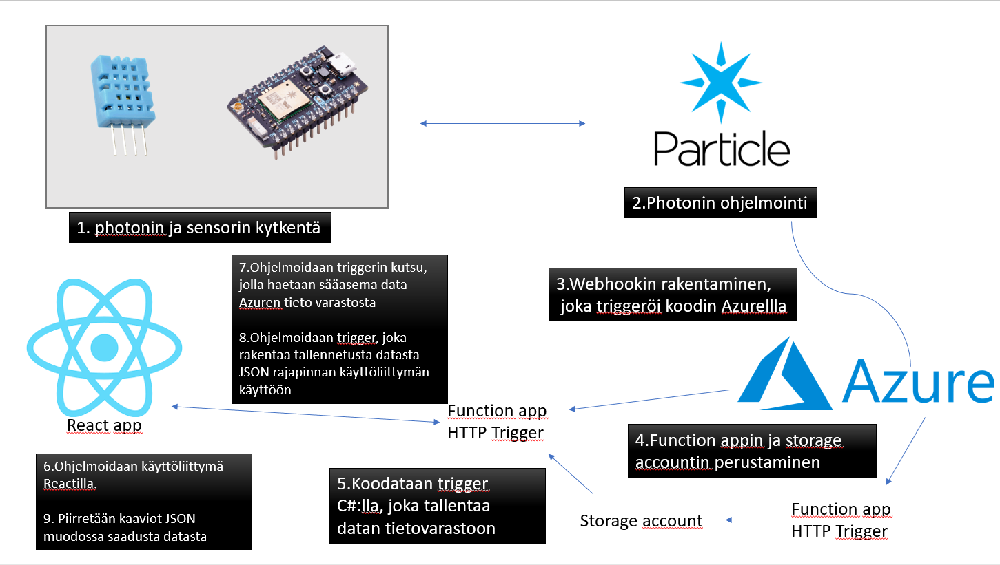

# IoT

## **Mikä on IoT?**
**I**nternet  **O**f **T**hings eli **IoT** tarkoitetaan laitteita, jotka pystyvät keräämään dataa ympäristöstään ja viestimään älykkäästi. 

IoT tarkoituksena on laajentaa internet yhteyttä puhelimista ja tietokoneista myös esimerkiksi kodinkoneille.

IoT prosessin toimivuuden tärkeimmät osat ovat:
1. **Sensorit/ laitteet**, joiden avulla kerätään dataa.
2. **Liitettävyys**, Laitteet lähettävät datan pilvipalveluun internetin välityksellä.
3. **Datan prosessointi**
4. **Käyttöliittymä**, jonka avulla käyttäjä voi nähdä tuloksia.

## **Sääasemajärjestelmän toimintakaavio**

1. Photoni ja DHT11 sensori kytketään.
2. Photoni ohjelmoidaan keräämään lämpötila ja ilmankosteus dataa Particle consolessa.
3.
### Laitteisto

### Komponentit
- Particle Photon kehityskortti
- Kosteutta ja lämpöä mittaava DHT11 sensori.

## **Käytetyt kehitysympäristöt**

## **Termihakemisto**

## **Viitteet**
https://www.guru99.com/iot-tutorial.html
https://fi.wikipedia.org/wiki/Esineiden_internet
