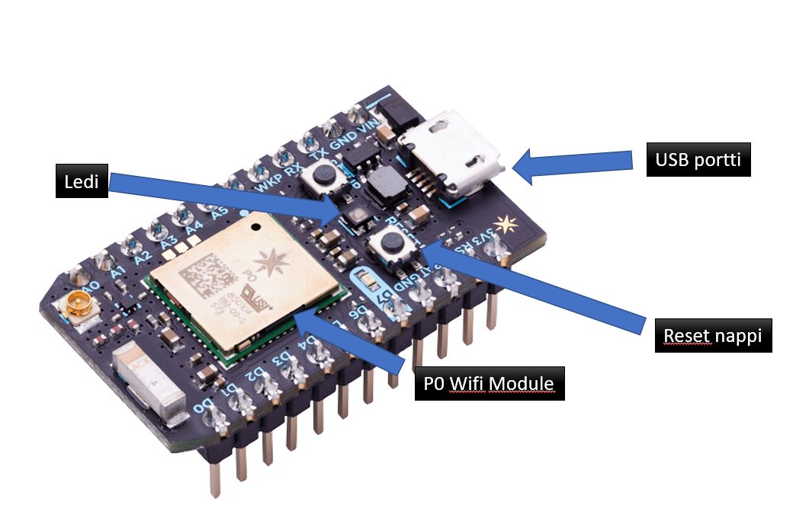
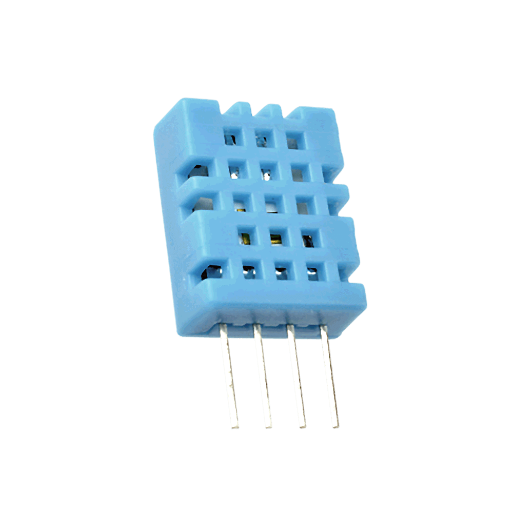
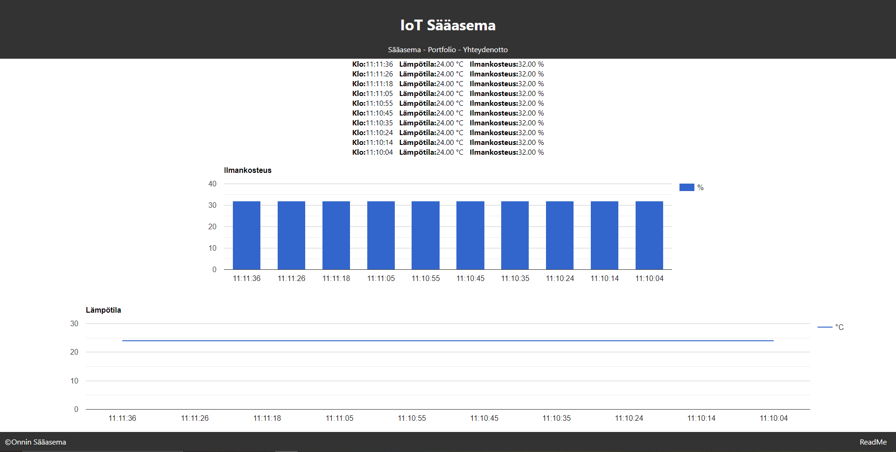

# IoT


## **Mikä on IoT?**
**I**nternet  **O**f **T**hings eli **IoT** tarkoitetaan laitteita, jotka pystyvät keräämään dataa ympäristöstään ja viestimään älykkäästi. 

IoT tarkoituksena on laajentaa internet yhteyttä puhelimista ja tietokoneista myös esimerkiksi kodinkoneille.

IoT prosessin toimivuuden tärkeimmät osat ovat:
1. **Sensorit/ laitteet**, joiden avulla kerätään dataa.
2. **Liitettävyys**, Laitteet lähettävät datan pilvipalveluun internetin välityksellä.
3. **Datan prosessointi**
4. **Käyttöliittymä**, jonka avulla käyttäjä voi nähdä tuloksia.


Esimerkki: IoT tarjoaa mahdollisuuden kiinteistön seurantaan. 
Lämpötilan tarkkailussa rakennukseen asennetut anturit ja keskusyksikkö yhdistetään IoT:llä kokonaisuudeksi. Yhdistämällä usean kiinteistön lämpötilan seurannan vähennetään kuluja ja päästöt vähenevät.
Muita seurattavia muutoksia voivat olla sähkön kulutus ja kosteus.
Kotien toimintaa voidaan seurata etänä älypuhelimella.
IoT siis tarjoaa mahdollisuuden seurata kodissa tapahtuvia muutoksia.

## **Sääasemajärjestelmän toimintakaavio**

### IoT-järjestelmän rakenne

IoT järjestelmän rakenne alkaa **antureista**, jotka keräävät dataa. Kerätyn tiedon avulla ohjelmoidaan laitteet toimimaan halutulla tavalla. Seuraavaksi on **tietoliikenne**, jonka avulla antureiden tieto viedään pilvipalveluun. Sitten tulee **tietovarastot** ja  **pilvialustat** jonne dataa tallennetaan pilvessä. Viimeisenä tulee **analytiikka**, jossa dataa päästään hyödyntämään.


### Laitteisto
**Particle Photon** :



- USB portti, jos photoni saa virran.
- ARM Cortex M3 Prosessori.
- Ohjelmoitava ledi, joka vilkkuu kun koodia 'flashataan'
- 5 Analogista ja 7 digitaalista pinniä.
- Mukana tulee pääsy Particle Cloud pilvi ympäristöön.

### Komponentit
### **Anturit**
Antureita on monenlaisia:

**Kuulevat anturit** nimensä mukaisesti kuulevat ja tunnistavat erillaisia ääniä ja niiden voimakkuutta, sekä taajutta.

- Kuulevilla antureilla voidaan toteutaa esimerkiksi ohjelma, joka tunnistaa aseen laukauksen ja lasin rikkoutumisen. Tällä tiedolla paikalle voidaan lähettää apua.   _(Sallamaari Muhonen, Aistien internet 1.jakso)_
- Hoivakodeissakin voidaan hyödyntää kuulevia antureita yöhoitajien kierroksien sijasta. Hoitajien ei tarvitse käydä jokaisen ovella häiritsemässä unta ja anturit kuulevat kun vanhuksella on joku hätänä.   _(Sallamaari Muhonen, Aistien internet 1.jakso)_
- Kuulevia antureita voi myös asennuttaa tienvarsiin havaitsemaan ohimenevien autojen määrää ja ajoneuvon tyyppiä. _(Aapo Rista, Aistien internet 1.jakso)_
- Huono kuuloisille voisi kehittää sovelluksen, joka tunnistaa kun asunnossa kuuluu ääntä ja havannollistaa sen visuaalisesti tai viestillä. _(Aapo Rista, Aistien internet 1.jakso)_
- Toimistoiden melua voidaan mitata ja datan avulla voidaan määritellä meluisimmat paikat ja päivät. _( Rick Aller, Aistien internet 1.jakso)_

Kuuleva anturi voi tunnistaa käytännössä minkä tahansa äänen. Esimerkiksi linnunlaulun, miehen ja naisen äänen eron ja sanallisen aggresion, kun ihmisen puheentahti kiihtyy ja äänen voimakkuus nousee.

**Tuntevat anturit** havaitsevat esimerkiksi liikettä, painoa, lämpöä ja kosteutta. Kerätyn tiedon avulla voidaan vaikuttaa esimerkiksi lämpötilaan.

- Tuntevia antureita on käytetty esimerkiksi digitaalisessa pillerissä, joka kosteutta mittaavan sensorin avulla kertoo onko potilas ottanut pillerin. _(Sallamaari Muhonen, Aistien internet 2.jakso)_
- Elämien hyvinvointiakin voi seurata tunto sensoreilla, esimerkiksi lehmään kytkettävä sensori seuraa kävelyn määrää ja hännän liikkeitä selvittääkseen lehmän voinnin. _(Sallamaari Muhonen, Aistien internet 2.jakso)_
- Sensoreilla voi myös hyödyntää rahdin sijainnin, kosteudella ja lämpötilalle seurannassa. _(Jukka Kauppinen, Aistien internet 2.jakso)_
- Rakennusten terveyden valvonnassa sensoreita voi hyödyntää esimerkiksi asentamalla kosteuttamittaavia sensoreita puutaloihin seuraamaan rakenteiden terveyttä. _(Sallamaari Muhonen, Aistien internet 2.jakso)_

**Haistavat anturit** tunnistavat niille määrättyjä hajuja esimerkiksi hometta tai kaasun rikkipitoisuuksia. Toisinkuin muut anturit niin Haistavat anturit yhdistävät biologiaa ja elektroniikka. Anturit eivät vielä pysty tunnistaman kaikkia hajuja.

- Haistavilla antureilla tutkitaan merialusten polttoaineden rikkipitoisuutta.  _(Kimmo Salonen, Aistien internet 3.jakso)_
- Tutkitaan koulujen sisäilmaongelmia, jotka voidaan saadulla datalla sitten korjata. _(Tuukka Martikainen, Aistien internet 3.jakso)_
- Anturit voivat havaita homeen myös ennen ihmistä, joka auttaa leviämisen estämisessä. _(Sallamaari Muhonen, Aistien internet 3.jakso)_

**Näkevät anturit** voi nähdä kaiken mitä ihmissilmäkin näkee, eli pystyy erottelemaan värejä. Jotkin anturit voivat nähdä jopa ihmistä laajemmin.

- Näkeviä antureita voidaan hyödyntää esimerkiksi rakennuksien liiketunnistimissa valojen sytyttämiseen ja hälyttää jos tilassa on epäilyttävää liikettä. _(Sallamaari Muhonen, Aistien internet 4.jakso)_
- Niillä voidaan myös tutkia rahtikontin täyttö astettä ja vahtia että tavarat pysyvät kontissa. _(Sallamaari Muhonen, Aistien internet 4.jakso)_
- Kognitiivinen konenäkö oppii toistojen jälkeen tunnistamaan erillaisia virheitä. _(Sallamaari Muhonen, Aistien internet 4.jakso)_
- Robotti imurit hyödyntävät näkö antureita, jotka mallintava imuroitavan huoneen. Ne käyttävät myös infrapunaa apuna huoneen mallintamisessa. _(Sallamaari Muhonen, Aistien internet 4.jakso)_
- Näkevää anturia on hyödynnetty myös robottikoirassa, joka tarkkailee biomassan laatua. _(Sallamaari Muhonen, Aistien internet 4.jakso)_

**DHT11 Sensori**

on edullinen **lämpötilaa** ja **ilmankosteutta** mittaava sensori. Se lähettää kerätyn datan datapinnin kautta esimerkiksi **Photonille** jota käytimme sääasemassa.

### Palvelut
Sääasema hyödyntää Microsoft Azuren pilvipalveluja.

Pilvipalvelujen hyviä puolija ovat joustava resurssien käyttö, tietojen säilyvyys ja helppo käyttöisyys.

Huonoja puolija taas ovatkin tietoturva riskit ja yksityisyyden menettäminen.

### Ohjelmointi
Particle photoniin ohjelmoitu koodi.
Ohjelma tarvitsee Adafruit DHT Particle kirjaston toimiakseen .

```
#include <Adafruit_DHT_Particle.h>

#define DHTPIN D0
#define DHTTYPE DHT11

double temperature;
double humidity;

int led = D6;

DHT dht(DHTPIN, DHTTYPE);


void setup() {
  
  dht.begin();
  Particle.variable("temperature", temperature);
  Particle.variable("humidity", humidity);
  
  pinMode(led, OUTPUT); 
  digitalWrite(led, LOW);


  Particle.function("led",ledToggle);
  
  Particle.subscribe("hook-response/temperatureOnni", myHandler, MY_DEVICES);
  
}

void loop() {

  float h = dht.getHumidity();
  float t = dht.getTempCelcius();
  temperature=t;
  humidity=h;

  if(isnan(h) || isnan(t)) {
    Serial.println("Failed to read from DHT sensor!");
    return;
  }

  
  String data = String::format("{\"Hum(\%)\": %4.2f, \"Temp(°C)\": %4.2f}", h, t);
  Particle.publish("temperatureOnni", data, PRIVATE);
  
  delay(10000);

}

int ledToggle(String command) {

    if (command=="on") {
        digitalWrite(led,HIGH);
        return 1;
    }
    else if (command=="off") {
        digitalWrite(led,LOW);
        return 0;
    }
    else {
        return -1;
    }
}
void myHandler(const char *event, const char *data) {
}
```
Azurelle tehdyn triggerin koodi.

```
#r "Newtonsoft.Json"
#r "Microsoft.WindowsAzure.Storage"
using Microsoft.WindowsAzure.Storage.Table;
using System.Net;
using System.Text;
using Newtonsoft.Json;

public static async Task<HttpResponseMessage> Run(HttpRequestMessage req, [Table("IoTData", "DeviceData")] IQueryable<IotData> inputTable, TraceWriter log)
{
    log.Info("C# HTTP trigger function processed a request.");
    string amount = req.GetQueryNameValuePairs()
        .FirstOrDefault(q => string.Compare(q.Key, "amount", true) == 0)
        .Value;
    int max = 0;
    Int32.TryParse(amount, out max); //muutetaan amount integeriksi
    log.Info("määrä: " + max);
    string deviceId = req.GetQueryNameValuePairs()
        .FirstOrDefault(q => string.Compare(q.Key, "deviceId", true) == 0)
        .Value;

    
    List<IotData> iotDatas = new List<IotData>();
    List<IotData> orderedDatas = inputTable.Where(p => p.PartitionKey == deviceId).ToList(); 
    log.Info("count: " + orderedDatas.Count);
    int count = 1;
    foreach (IotData row in orderedDatas.OrderByDescending(o => o.Timestamp))
    {
            iotDatas.Add(row);
            if (max > 0 && count++ >= max) 
            {
                break;
            }
    }

    string jsonRet = JsonConvert.SerializeObject(iotDatas); 
    return new HttpResponseMessage(HttpStatusCode.OK) { 
    Content = new StringContent(jsonRet, Encoding.UTF8, "application/json")
    };
}

public class IotData : TableEntity
{
    public string DeviceId { get; set; }
    public string Hum {get; set;}
    public string Temp {get; set;}

}
```


Käyttöliittymän koodi.

```
import React, { useState } from 'react';
import './App.css';
import Chart from "react-google-charts";
import Header from './components/layout/Header';
import Footer from './components/layout/Footer';
import Portfolio from './components/Portfolio';
import Yhteydenotto from './components/Yhteydenotto';
import { BrowserRouter as Router, Route, Switch } from 'react-router-dom';
function App() {


const initWeather = [];

const [weather, setWeather] = useState(initWeather);


function convertUTCDateToLocalDate(date) {
  //var dateLocal = new Date(date);
  new Date(date.getTime() + date.getTimezoneOffset()*60*1000);
  return date;
}


let chartHumData = [
  ['Aika', '%'],
  ['Loading...', 0]

];


let chartTempData = [
  ['Aika', '°C'],
  ['Loading...', 0]

];

fetch('https://oppilas-11.azurewebsites.net/api/HttpTriggerCSharp2?code=2oO4x2gTHZUkLoeN/jWdnzkvg5BlU9uud6b75mc/wr3jKukq0wtswg==&deviceId=3e0037001947393035313138&amount=10')
  .then(response => response.json())
  .then(json => setWeather([...json]));

let humtempkey = 1;
const rows = () => weather.map(temphum => {

  if(chartHumData[1][0] === 'Loading...'){
    chartHumData.pop();
  }

  if(chartTempData[1][0] === 'Loading...'){
    chartTempData.pop();
  }


  chartHumData.push([String(convertUTCDateToLocalDate(new Date(temphum.Timestamp))).split(' ')[4],parseInt(temphum.Hum)])
  
  chartTempData.push([String(convertUTCDateToLocalDate(new Date(temphum.Timestamp))).split(' ')[4],parseInt(temphum.Temp)])

  

  return <div key={humtempkey++}>
    <b>Klo:</b>{String(convertUTCDateToLocalDate(new Date(temphum.Timestamp))).split(' ')[4]} &nbsp; <b>Lämpötila:</b>{temphum.Temp} °C &nbsp; <b>Ilmankosteus:</b>{temphum.Hum} % 
  </div>
})


  return (
    <Router>
    <div className="App">
    <Header />
    <Switch>
    <Route path ="/portfolio">
        <Portfolio />
    </Route>
    <Route path ="/yhteydenotto">
      <Yhteydenotto />
    </Route>
      <Route path="/">
      {rows()}
      
     <div style={{ display: 'flex'}}>
      <Chart
        width={'100%'}
        height={300}
        chartType="ColumnChart"
        loader={<div>Loading Chart</div>}
        data={chartHumData}
        options={{
          title: 'Ilmankosteus',
          chartArea: {width: '50%'},
          vAxis: {
            title: '',
            minValue: 0,
          },
        }}
        legendToggle
      />
      
      </div>


      <div style={{ display: 'flex'}}>
      <Chart
        width={'100%'}
        height={300}
        chartType="LineChart"
        loader={<div>Loading Chart</div>}
        data={chartTempData}
        options={{
          title: 'Lämpötila',
          chartArea2: {width: '50%'},
          vAxis: { minValue: 0 },


        }}
        />

      </div>
      </Route>
      </Switch>
      <Footer />
    </div>
   </Router> 
  );
}

export default App;
```

## **Käytetyt kehitysympäristöt**

**Replit.com** palvelu, jolla käyttöliittymän tehtiin.  
**Microsoft Azuren** Pilvipalvelu, johon data tallentuu.  
**Particle Console**, jolla photoni ohjelmoitiin.  

## **Termihakemisto**
DHT11 = Lämpöä ja ilmankosteutta mittaava sensori  
Particle Photon = IoT kehityskortti  
Webhook = Heti tapahtuva tiedon siirto aplikaatiosta toiselle  
Microsoft Azure = Pilvipalvelu  
Storage account = Tiedot tallentuvat tänne  
JSON = Tiedostomuoto, joka on tarkoitettu tiedonvälitykseen  

## **Viitteet**
https://www.guru99.com/iot-tutorial.html  
https://fi.wikipedia.org/wiki/Esineiden_internet  
https://www.youtube.com/watch?v=nzg_x1-EFpc&list=PLtbOrywM-BA8qzTn5fkzhlcaR3d92HYO7  
https://www.youtube.com/watch?v=2p7V_6WzVOw&list=PLtbOrywM-BA8qzTn5fkzhlcaR3d92HYO7  
https://www.youtube.com/watch?v=m6eExiGqtS0  
https://www.dna.fi/yrityksille/aistien-internet-podcast  